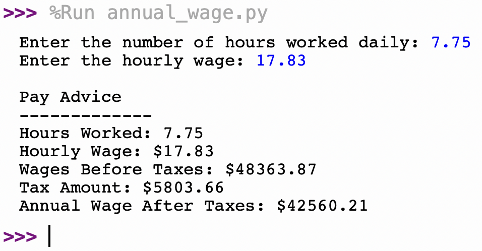

# Challenge: Annual Wage Calculator

**Description**: Write a Python 3 program called wage_calculator.py that accepts user input from the keyboard for the hours worked and hourly wage. The program calculates the total wages for the year, assuming the person works 350 days per year and 12% taxes are deducted from the wages.

**Purpose**: Provide experience with writing an interactive Python program that accepts input, performs a calculation, then displays the result as output.

## Requirements:

Your program needs to:

- Ask the user to input from the keyboard for two inputs, one is the hours worked daily and the other is the hourly wage. Multiplying hours worked daily and hourly wage will give you the wages earned in a day.
- The two input numbers are not necessarily integers. For example, the user can enter values like 35.5 for hours worked or 17.85 for hourly wage.
- the user cannot work more than 24 hours in a day
- Calculate the yearly wage given the two inputs
  - Note that the working hours is daily. Assume the user works 350 days per year and the same amount of hours every day.
  - It would help to first write down the mathematical formula needed to calculate the yearly wage
- 12% will be deducted from yearly earnings for taxes
- Print the a Pay Advice containing:
  - hours worked
  - hourly wage
  - wages before taxes
  - tax amount
  - annual wages after taxes
  - money values should be printed with a $ sign and all numbers should be rounded to 2 decimal places
 
## Sample Output

